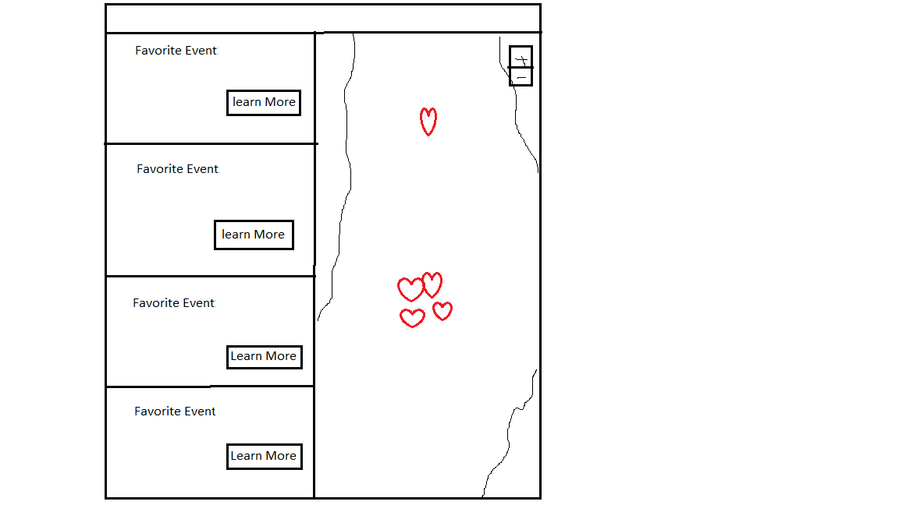

The content below is an example project proposal / requirements document. Replace the text below the lines marked "__TODO__" with details specific to your project. Remove the "TODO" lines.

# TicketAround 

## Overview

TicketAround is a ticket recommendation site that recommends tickets/events within 25mi,50mi and 75mi radius of user's Geolocations(More sophisticated recommedation may be implemented if time permits). 

It is a webapp that allows users to browse nearby events on a google map and browse favorited events once logged in. For every event selected by users, they can click on the event and be redirected to ticketmaster.com to make purchases.  


## Data Model

The application will store Users, Items, Favorites and 

* items have item_id, name, address, category, image_url,url
* users have user_id,username,password hash, email
* favorites have user_id(as reference), multiple items(by reference) 

Item:
```javascript
{

  item_id://autogenerated id
  name:
  address:
  category://string
  image_url:
  url:
}
```

User:
```javascript
{
  username: //String
  hash: // a password hash,
  email:
  favorites:
}
```
Favorite:
```javascript
{
  user:

  items:[item1, item2,...]
}
```


## [Link to Commented First Draft Schema](db.js) 

## Wireframes

/login - page for login or sign up 


/home  - page for home page


/category/slug - page for showing specific category of events


/nearby  -  page for nearby events


/favorites   -  page for showing user's favorite events


## Site map

(___TODO__: draw out a site map that shows how pages are related to each other_)


## User Stories or Use Cases

1. as non-registered user, I can register a new account or continue as guest 
2. as non-registered user, I can log in
3. as non-registered user or signed in user, I can browse events by category or nearby location
4. as non-registered user or signed in user, I can be redirected to third-party sites to learn more detail about an event
5. as a user, I can add events to favorite list
6. as a user, I can view past favorite events


## Research Topics

* (5 points) react.js
    * I'm goint to use react.js library for front end; it's a challenging library to learn, so I've assigned it 5 points
* (3 points) Integrate user authentication
    * I'm going to be using passport.js for user authentication
* (2 points) Third-Party APIs: ticketmaster api, google map api
    * see <code>https://developer.ticketmaster.com/products-and-docs/apis/discovery-api/v2/</code>
    * see <code>https://developers.google.com/maps/documentation/javascript/overview</code>


10 points total out of 8 required points 


## [Link to Initial Main Project File](app.js) 

[app.js link](./app.js)

## Annotations / References Used

1. [passport.js authentication docs](http://passportjs.org/docs) - (https://github.com/nyu-csci-ua-0480-034-fall-2020/xg665-final-project/blob/d936194e56b9e1d96d755a20740402602a1be348/app.js#L37)
2. [tutorial on react.js](https://vuejs.org/v2/guide/) - (https://github.com/nyu-csci-ua-0480-034-fall-2020/xg665-final-project/blob/d936194e56b9e1d96d755a20740402602a1be348/client/src/App.js#L4)
